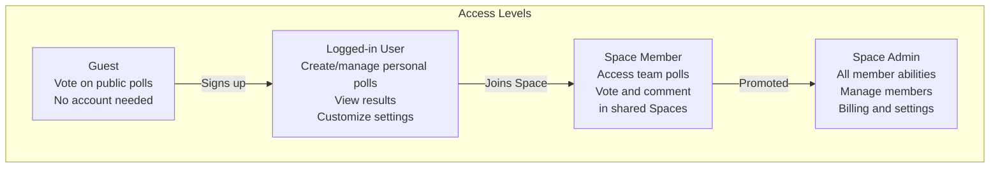

This section introduces **Rallly**, a web application for creating scheduling polls that help groups find the best time for meetings or events based on everyone's availability. It's ideal for individuals coordinating with friends or colleagues, teams using shared **Spaces** for collaboration, and organizations needing centralized management, with support for guest participation (no account required), personal accounts, and self-hosted deployments. Rallly eliminates back-and-forth emails by letting poll creators propose time slots and participants vote quickly. For hands-on setup, see [Getting Started](getting-started.md). Learn about team workflows in [Spaces and Team Collaboration](spaces-and-team-collaboration.md), poll creation in [Creating and Sharing Polls](creating-and-sharing-polls.md), and advanced options like [Self-Hosting and Administration](self-hosting-and-administration.md).

## What is Rallly?

**Rallly** lets you create a poll with proposed dates and times, share a link with participants, and view results to pick the optimal slot. Participants simply click their available options—no login needed for guests. Logged-in users can manage multiple polls, customize settings, and access advanced features.

> [!NOTE]  
> **Rallly** is pronounced like "rally" (as in gathering people) but with an extra *L*.

Key capabilities include:
- Proposing multiple time slots in a single poll.
- Real-time voting and result visualization (e.g., heatmaps showing availability).
- Customizable poll titles, descriptions, and lengths.
- Support for unlimited polls and participants on the free plan.
- Team **Spaces** for shared polls, member invites, and group billing.

## User Roles and Access Levels

Different roles determine what you can do in **Rallly**. Guests have basic voting access, while account holders unlock management tools.

## Individual vs. Team Usage

**Rallly** supports both personal and collaborative workflows:

| Usage Type | Who It's For | Key Features | Limitations |
|------------|--------------|--------------|-------------|
| **Individual** | Solo users, small groups | Unlimited free polls, guest voting, personal results dashboard | No team sharing or centralized billing |
| **Team (Spaces)** | Organizations, departments | Shared polls, member management, group subscriptions | Requires Pro/Spaces plan for advanced team features |

For pricing details, including free vs. **Pro**/**Spaces** comparisons, see [Billing and Subscriptions](billing-and-subscriptions.md).

## Getting Started Workflow

1. Visit the **Rallly** homepage and click **Create a Poll**.
2. Enter a **Poll Title** (e.g., *Team Offsite*) and optional **Description**.
3. Add time slots using the **Add Option** button—select dates, times, and duration.
4. Click **Create Poll** to generate a shareable link.
5. Share the link; participants vote by clicking available slots.
6. Return to your poll dashboard to view results and finalize.

> [!TIP]  
> Use the **Copy Link** button for quick sharing via email, chat, or calendars.

## Free vs. Pro/Spaces Features

Most core features are free forever. Upgrade for teams or extras:

| Feature | Free | Pro/Spaces |
|---------|------|------------|
| Poll Creation | Unlimited | Unlimited + advanced customizations |
| Participants per Poll | Unlimited | Unlimited |
| Guest Voting | Yes | Yes |
| Personal Poll Management | Yes | Yes + analytics |
| Team Spaces | No | Yes (member invites, shared dashboard) |
| Centralized Billing | No | Yes |
| Custom Domains/Branding | No | Yes (Spaces) |
| Priority Support | No | Yes |

See [Billing and Subscriptions](billing-and-subscriptions.md) for upgrade paths.

## Summary

- **Rallly** streamlines group scheduling with simple polls, real-time voting, and clear results—no emails required.
- Supports *guests* for quick participation and *logged-in users* for full management.
- Choose *individual mode* for personal use or *Spaces* for teams: [Spaces and Team Collaboration](spaces-and-team-collaboration.md).
- Start creating polls: [Getting Started](getting-started.md) and [Creating and Sharing Polls](creating-and-sharing-polls.md).
- Manage settings and billing: [User Settings and Preferences](user-settings-and-preferences.md) and [Billing and Subscriptions](billing-and-subscriptions.md).
- Self-host for full control: [Self-Hosting and Administration](self-hosting-and-administration.md).