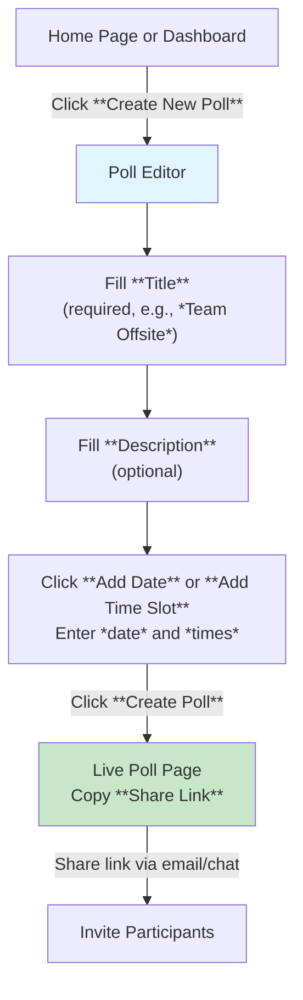
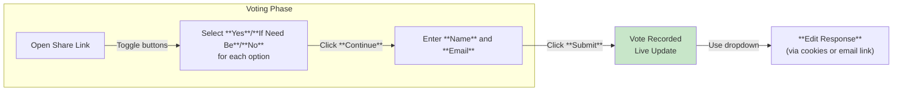

This section covers getting started with Rallly, aimed at new users who want to quickly sign up (or use guest mode), create their first poll, invite participants, and view results—all without needing an account right away. Guest mode lets you jump in instantly, with the option to claim your poll later by signing up. Once comfortable, explore advanced features in [Creating and Sharing Polls](creating-and-sharing-polls.md), team collaboration in [Spaces and Team Collaboration](spaces-and-team-collaboration.md), or account options in [User Settings and Preferences](user-settings-and-preferences.md).

## Overview
Getting started in Rallly is streamlined for speed: land on the home page, create a poll in moments, share a link with participants, and watch votes roll in via live results. No credit card or complex setup required. Guest-created polls are public and editable via the share link, and you can convert them to a full account anytime.

## Account Creation and Login
New users see prominent buttons on the home page: **Sign Up**, **Login**, and **Continue as Guest**.

- **Sign Up**: Creates a free account for saving polls, notifications, and history. Enter your *email address* and click **Sign Up**—you'll receive a magic link to verify and access your dashboard.
- **Login**: Use your *email address* for a magic link to return to your polls.
- **Continue as Guest**: Skips account creation; ideal for one-off polls. Your poll link persists for editing and viewing.

> [!NOTE] Guest polls are fully functional but not tied to an account initially. Sign up later using the **Claim this Poll** option on your poll page to save it permanently.

## Creating Your First Poll
From the home page or dashboard, click **Create New Poll** to open the poll editor.

1. Enter a **Title** (e.g., *Team Meeting*)—this appears at the top of the poll.
2. Add a **Description** (optional)—provides context for participants.
3. Input dates or times using the **Add Date** or **Add Time Slot** buttons—specify *date*, *start time*, and *end time* in your preferred format.
4. Click **Create Poll** to generate a unique share link.

Your new poll opens immediately, showing empty results. Copy the **Share Link** from the top to invite others.

## Inviting Participants and Viewing Results
- Paste the **Share Link** into emails, chats, or messages—no accounts needed for voters.
- On your poll page, results update live: tally **Yes**, **If Need Be**, and **No** votes per option, plus participant names.
- Refresh or leave the tab open to see changes. Use the **Results** tab for charts and summaries.

Participants access the poll via the link and vote as described below.

## How Participants Vote
Anyone with the share link can vote—no signup required.

| Field | Required | Accepted Values | Description |
|-------|----------|-----------------|-------------|
| Date/Time Buttons | Yes | **Yes**, **If Need Be**, **No** | Toggle under each option to indicate availability. Unselected defaults to **No**. |
| **Name** | Yes | Any text (e.g., *John Doe*) | Identifies your votes in results. |
| **Email** (optional) | No | Valid email | Sends a magic link for editing votes later from any device. |

1. Open the share link and click buttons under each date/time: **Yes** (available), **If Need Be** (flexible), or **No** (unavailable).
2. Click **Continue**.
3. Enter **Name** and **Email** (recommended), then click **Submit**.
4. Votes appear immediately. To edit, use the dropdown next to your **Name** and select **Edit Response**.

> [!TIP] Advise participants to enter an *email*—it emails a direct edit link, preventing loss of edit access.

## Troubleshooting
Common issues users encounter when starting out:

| Message/Issue | Severity | Meaning |
|---------------|----------|---------|
| Cannot edit my response | Warning | Browser cookies were cleared, or you're on a new device—the system no longer recognizes you. Ask the poll creator to delete or edit your response for you. |
| Lost access to my vote | Info | Without an email on submit, edits rely on browser cookies. Enter an *email* next time for a magic link, or contact the poll creator. |
| No votes showing | Info | Participants must click **Submit** after selecting options. Share the link again and remind them to complete all steps. |

## Summary
- Start instantly as a guest or sign up with *email* for persistent polls: click **Create New Poll**, add details, and share the link.
- Participants toggle **Yes**/**If Need Be**/**No**, enter **Name**/**Email**, and submit—results update live.
- Use email for edits to avoid cookie issues.
- Next: Customize polls in [Creating and Sharing Polls](creating-and-sharing-polls.md), manage teams in [Spaces and Team Collaboration](spaces-and-team-collaboration.md), or set preferences in [User Settings and Preferences](user-settings-and-preferences.md).