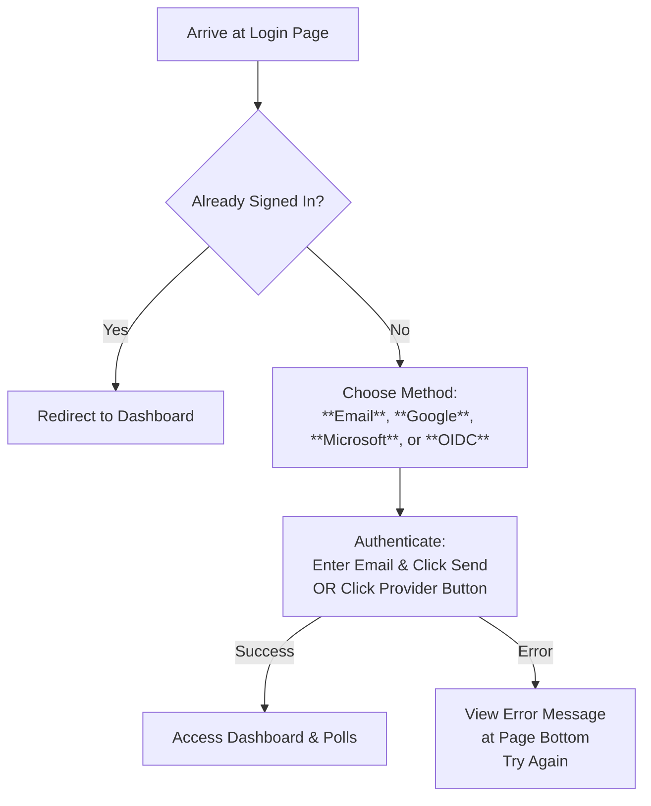
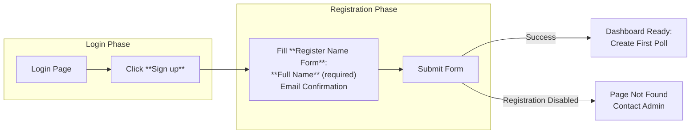

This section covers account creation and login processes, designed for new users setting up their first account and returning users accessing their polls and spaces. It serves as the entry point to the platform, enabling secure authentication before creating polls, collaborating in spaces, or managing settings. For next steps after login, see [Creating Your First Poll](creating-your-first-poll.md). For ongoing account management, see [User Settings and Preferences](user-settings-and-preferences.md).

## Overview
Account creation and login support multiple methods to suit different preferences, including email-based sign-in (with magic link or password options), single sign-on via **Google**, **Microsoft**, or custom OIDC providers, and guest access for quick trials without commitment. The login screen adapts based on available methods: if only one provider is configured (like OIDC), it automatically redirects to that flow. Registration is optional and only available when enabled by administrators. Upon success, users are redirected to the main dashboard; errors are displayed prominently at the bottom of the screen.

## Login Screen
The **Login** page greets users with a **Welcome** title and a description like "Login to your account to continue" (or a note if no methods are configured). It displays available authentication options in a clean, stacked layout.

### Available Login Methods
| Method | Requirements | Description |
|--------|--------------|-------------|
| **Email** | Valid email address; enabled by administrators | Enter your email to receive a magic link or use password (if configured). Click **Continue with Email** to start. |
| **Google** | Google account | Click **Continue with Google** to sign in via your Google profile. |
| **Microsoft** | Microsoft account | Click **Continue with Microsoft** to sign in via your Microsoft profile (e.g., work or school account). |
| **OIDC Provider** | Custom provider account (e.g., enterprise SSO) | Click the provider button (named by administrators, like "Company SSO") to authenticate. Automatically triggers if it's the only method available. |

- An **Or** divider separates email from social/SSO options when multiple methods are present.
- A **redirectTo** parameter (from shared links) preserves your intended destination after login.
- If you're already signed in (non-guest), you'll be automatically redirected to the dashboard.

> [!NOTE]  
> Guest users can continue without full login for basic access, but features like saving polls require a full account.

## Registration Screen
The **Register** page appears via the **Sign up** link on the login footer (only shown if registration is enabled). It features a **Create Your Account** title and description like "Streamline your scheduling process and save time."

- Fill out the **Register Name Form** (fields vary but typically include **Full Name** and email confirmation).
- A footer link **Log in** returns you to the login page if you already have an account.

## Step-by-Step Workflows

### Logging In
1. Navigate to the **Login** page (automatically shown for unauthenticated users).
2. Select your preferred method:
   - For **Email**: Enter your *email address* in the **Email** field and click **Send Magic Link** (or enter *password* if prompted).
   - For SSO: Click the provider button (e.g., **Continue with Google**).
3. Check your email or complete the provider flow.
4. Click links or confirm to access the dashboard.

### Creating an Account
1. From **Login**, click **Sign up** (if available).
2. On **Register**, enter your **Full Name** and confirm email/details in the form.
3. Submit the form to complete setup.
4. You're redirected to the dashboard to create your first poll.

## Troubleshooting
Common issues appear as user-friendly messages at the bottom of the auth pages.

| Message | Severity | Meaning |
|---------|----------|---------|
| Generic error notice (e.g., "Invalid credentials" or "Link expired") | Error | Authentication failed—check your email/password, link validity, or provider status. Refresh and retry. |
| "Login is currently not configured." | Warning | No login methods enabled—contact your space administrator to enable email or SSO. |
| Page not found on register | Error | Registration disabled by administrators—use an existing account or request access. |

> [!WARNING]  
> Magic links expire; request a new one if needed. SSO requires active provider accounts.

## Summary
- Access via **email** (magic link/password), **Google**, **Microsoft**, or **OIDC**; auto-redirects for single-method setups.
- **Register** only when enabled, starting with a simple name/email form.
- Guest mode allows quick starts; upgrade for full features.
- Errors are shown clearly—retry or contact admins as needed.

For creating polls post-login, see [Creating Your First Poll](creating-your-first-poll.md). Manage account details in [User Settings and Preferences](user-settings-and-preferences.md). Team logins relate to [Managing Members](managing-members.md) in spaces.