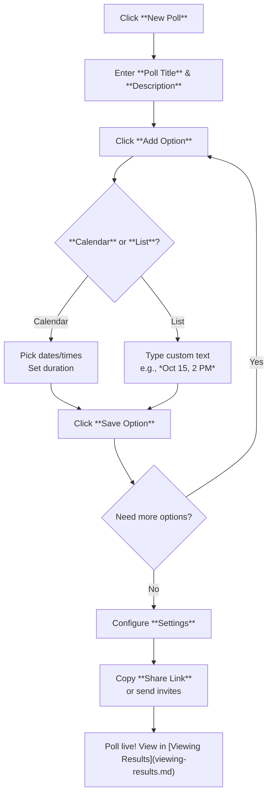

This section covers creating your first poll, the essential first step for new users to schedule events by collecting date and time preferences from participants. Designed for anyone organizing meetings, events, or decisions—whether personal or team-based—polls integrate seamlessly with your account after [Account Creation and Login](account-creation-and-login.md). Once created, expand options in [Adding Poll Options](adding-poll-options.md), invite others via [Inviting Participants](inviting-participants.md), or view votes in [Viewing Results](viewing-results.md). For team polls, use [Space Dashboard](space-dashboard.md).

## Overview
Creating a poll lets you define a **Title** and **Description**, add multiple date/time **Options** via intuitive calendars or manual lists, configure **Visibility** and other settings, and generate a unique shareable link. Polls are live immediately upon creation, with real-time updates as participants vote. No technical setup required—everything happens in your browser.

## Accessing the Poll Creation Screen
From the main dashboard or navigation menu:
1. Click **New Poll** (prominent button, often in the top-right or center).
2. The **Create Poll** screen opens, divided into panels: **Poll Details** (top), **Options** (middle), **Settings** (bottom), and **Preview & Share** (right sidebar).

## Entering Poll Details
Fill in the basic information to describe your poll:

| Field | Required | Accepted Values | Description |
|-------|----------|-----------------|-------------|
| **Poll Title** | Yes | Up to 100 characters, text only | Short, descriptive name (e.g., *Team Offsite 2024*). Appears at the top of the poll for all viewers. |
| **Description** | No | Up to 500 characters, text with basic formatting (bold, lists) | Additional context or instructions (e.g., *Choose your top 3 preferences for our annual retreat.*). Shown below the title. |

Changes update the live **Preview** pane instantly.

## Adding Date/Time Options
Options represent the slots participants can vote on. Add as many as needed:

1. In the **Options** panel, click **Add Option**.
2. Choose **Calendar Picker** (visual grid for selecting dates/times) or **List Entry** (manual text input).
3. For **Calendar Picker**:
   - Select start/end dates from the pop-up calendar.
   - Set time slots (e.g., *9:00 AM - 5:00 PM*) with duration picker.
   - Supports multiple days/times per option.
4. For **List Entry**:
   - Enter free-form text (e.g., *Monday, Oct 15, 2-4 PM* or *Option A: Zoom at 3 PM*).
5. Click **Save Option**; it appears as a clickable row in the list.
6. Drag rows to reorder, or click **Delete** (trash icon) to remove.

> [!NOTE]  
> Aim for 4-8 options to avoid overwhelming voters. Use **Calendar Picker** for time-based polls; **List Entry** for non-time decisions (e.g., locations).

## Poll Settings
Customize behavior in the **Settings** panel (toggle to expand):

| Setting | Default | Options | What It Controls |
|---------|---------|---------|------------------|
| **Visibility** | Link-only | Public (searchable), Link-only, Private (invite-only) | Who can access: Public indexes in search; Link-only requires the unique URL; Private needs email approval. |
| **Duration** | 7 days | 1 hour to 30 days, or *Never expires* | When voting closes automatically. Participants see a countdown. |
| **Multiple Votes** | Off | On/Off | Allows participants to select multiple options (e.g., top 3). |
| **Participant Names** | Optional | Required, Optional, Anonymous | Whether voters enter names (for accountability) or stay hidden. |
| **Notifications** | On | On/Off | Emails you on new votes (configurable in [Notifications and Emails](notifications-and-emails.md)). |

Toggle settings and watch the **Preview** update.

## Previewing and Sharing
- The **Preview** pane shows the exact voter view.
- Once ready, click **Create & Share** (green button at bottom).
- System generates a unique **Poll Link** (e.g., `yourapp.com/p/abc123`).
- Options: **Copy Link**, **Email Invite** (pre-fills participant emails), or **QR Code** for in-person sharing.
- Click **Dashboard** to return and manage.

> [!WARNING]  
> After creation, the **Poll Link** is permanent—share carefully. Edit polls later via [Managing Polls](managing-polls.md).

## Summary
- Create polls quickly with **Title**, **Description**, date/time **Options** (calendar or list), and customizable **Settings**.
- Share via unique **Poll Link** for instant voting; preview ensures accuracy.
- For next steps: add more options in [Adding Poll Options](adding-poll-options.md), invite via [Inviting Participants](inviting-participants.md), or track results in [Viewing Results](viewing-results.md).
- Team use: Create in a [Space Dashboard](space-dashboard.md) for collaboration.