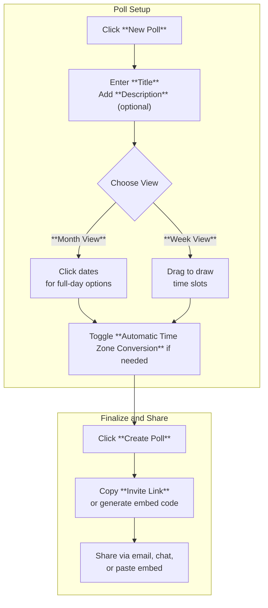

This section covers creating and sharing polls for scheduling events, designed for anyone organizing meetings, events, or group decisions—such as team leads, event planners, or friends coordinating get-togethers. Polls allow flexible date and time options that adapt to participants' time zones, with easy sharing via links or embeds. Once created, polls integrate with participant voting and results viewing; for basic setup including your first poll, see [Creating Your First Poll](creating-your-first-poll.md). For advanced options like adding more choices, see [Adding Poll Options](adding-poll-options.md). To invite others, refer to [Inviting Participants](inviting-participants.md).

## Overview
Creating a poll lets you define an event title, optional description, and multiple date/time slots for voting. The interface provides calendar views for quick selection, automatic time zone handling, and instant generation of shareable links or embeds. Polls are public by default but customizable for privacy and interaction.

## The New Poll Screen
Access this screen by clicking **New Poll** from the main dashboard or navigation bar. You'll see:
- A prominent **Title** field at the top.
- An optional **Description** area below for additional event details.
- A calendar picker with tabs for **Month View** and **Week View** to add time slots.
- A toggle for **Automatic Time Zone Conversion**.
- A **Create Poll** button at the bottom.

> [!NOTE]  
> The screen adapts to your current time zone but converts times for participants automatically unless disabled.

### Poll Data Fields
| Field | Required | Accepted Values | Description |
|-------|----------|-----------------|-------------|
| **Title** | Yes | Up to 100 characters, text only | The poll's name, shown to all participants and in share links. Changing it updates the poll header instantly. |
| **Description** | No | Up to 500 characters, text with basic formatting | Extra context for voters, like agenda or location. Supports line breaks for readability. |

## Adding Date and Time Options
Switch between **Month View** (for full-day or multi-day selections) and **Week View** (for drawing specific time slots). Click dates or drag to select ranges—options appear as listed slots below the calendar. Add as many as needed; participants vote by selecting their availability.

> [!TIP]  
> Use **Month View** for broad date choices and **Week View** for precise hourly blocks.

## Poll Settings
Customize behavior before creating the poll.

| Setting | Default | Options | What It Controls |
|---------|---------|---------|------------------|
| **Automatic Time Zone Conversion** | Enabled | On/Off toggle | Converts displayed times to each participant's local time zone for remote groups. Disable for fixed universal times (e.g., UTC). |

## Step-by-Step: Creating and Sharing a Poll

1. Click **New Poll** from the dashboard.
2. Fill in the **Title** and optionally the **Description**.
3. Select **Month View** or **Week View** tab and add your date/time options by clicking or dragging.
4. Adjust the **Automatic Time Zone Conversion** toggle as needed.
5. Click **Create Poll**—your poll is live, and the **Invite Link** appears immediately.
6. Copy the **Invite Link** or select **Embed** to get code for websites; share via email, messaging apps, or social media.

> [!WARNING]  
> Once shared, the link is public—anyone with it can vote unless you add passwords or restrictions later (see [Managing Polls](managing-polls.md)).

## Summary
- Build polls quickly with title, description, and calendar-based date/time options in **Month View** or **Week View**.
- Enable **Automatic Time Zone Conversion** by default for global participants.
- Share instantly via **Invite Link** or **Embed** after clicking **Create Poll**.
- For expanding options, see [Adding Poll Options](adding-poll-options.md); for voting and results, see [Participating and Voting](participating-and-voting.md) and [Viewing Results](viewing-results.md); manage ongoing polls in [Managing Polls](managing-polls.md).