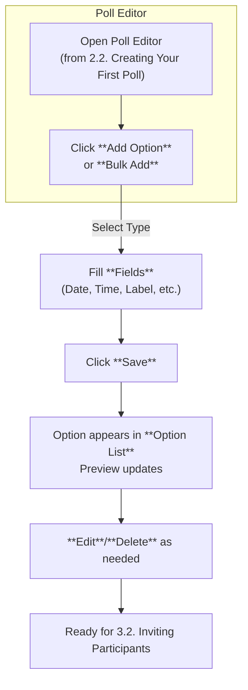

This section covers adding poll options, a core step in poll creation that lets you define flexible choices like dates, time slots, or custom entries for participants to vote on. It's designed for poll creators—anyone setting up scheduling polls, decision polls, or group choices—who need intuitive tools to specify availability. Options integrate directly with your poll setup, building on 2.2. Creating Your First Poll and feeding into sharing via 3.2. Inviting Participants and results viewing in 4.1. Viewing Results. For team-based polls, options can be managed collaboratively in 6. Spaces and Team Collaboration.

## Overview

Adding poll options allows you to create single dates, time slots with durations, or labeled custom entries using visual calendars, time pickers, or text input. Each option appears as a selectable choice for voters, with support for quick bulk addition via calendar views. This feature ensures polls are clear and actionable, whether for meetings, events, or preferences.

## Poll Options Interface

When editing or creating a poll, the **Options** panel appears below the poll title and description. It shows a list of current options (empty at first) with thumbnails or previews for dates/times. Key controls include:

- **Add Option** button: Opens a modal or inline form to create a new option.
- **Option List**: Cards for each option, showing preview (e.g., "Monday, Oct 14, 2-4 PM"), **Edit** icon, **Duplicate** icon, and **Delete** icon.
- **Bulk Add** dropdown: Quick access to calendar views.
- **Sort** dropdown: Reorder options by time, label alphabetically, or manually drag-and-drop.

> [!NOTE]  
> Up to *500 options* per poll on free plans; unlimited on paid subscriptions (see 8. Billing and Subscriptions).

## Ways to Add Options

### Using Calendars
Click **Bulk Add > Week Calendar** or **Bulk Add > Month Calendar** to open a grid view.

1. Navigate the calendar using arrow buttons or swipe.
2. Click any date cell to select it (highlights in blue).
3. Multi-select by holding **Shift** or dragging.
4. Toggle **Add Times** to attach default durations (e.g., 1 hour).
5. Click **Confirm Selection** to add options with auto-generated labels like "Oct 14".

Calendars default to the poll's suggested timezone and highlight unavailable dates from prior polls if linked.

### Using Time Pickers for Slots
Ideal for scheduling polls.

1. Click **Add Option**.
2. Select **Time Slot** type.
3. Use **Start Time** picker (hour/minute wheels) and **End Time** picker.
4. Set **Duration** slider (15 min to 8 hours) to auto-fill end time.
5. Add optional **Label** for custom text.
6. Click **Save**.

### Manual Entry
For custom or non-time options.

1. Click **Add Option**.
2. Select **Custom** or **Date Only**.
3. Enter **Date** in *MM/DD/YYYY* format or use picker icon.
4. Fill **Label** for descriptive text (e.g., "Team Offsite").
5. Click **Save**.

## Option Fields

All options use this standard form:

| Field       | Required | Accepted Values                  | Description |
|-------------|----------|----------------------------------|-------------|
| **Type**    | Yes     | *Date Only*, *Time Slot*, *Custom* | Determines input controls shown; *Time Slot* enables pickers. |
| **Date**    | Yes (except Custom) | Calendar picker or *MM/DD/YYYY* | Specific day; auto-adjusts to poll timezone. |
| **Start Time** | Yes (Time Slot) | 12/24-hour picker (*HH:MM*) | Beginning of slot; snaps to 15-min intervals. |
| **End Time** | Yes (Time Slot) | 12/24-hour picker (*HH:MM*) | End of slot; must be after start. |
| **Duration** | No     | Slider (*15m* to *8h*) or auto-calc | Overrides end time; displays on option preview. |
| **Label**   | No      | Up to *100 characters*, text only | Custom name shown to voters (e.g., "Lunch Break"); defaults to date/time if blank. |
| **Timezone**| No      | Dropdown (*UTC*, *America/NY*, etc.) | Overrides poll default; voters see local conversion. |

Changing **Duration** auto-updates **End Time**. Deleting an option prompts "Remove this choice? Voters won't see it anymore."

## Adding Options Workflow

## Configuration Options

Poll-level settings affect all options:

| Setting              | Default          | Options                          | What It Controls |
|----------------------|------------------|----------------------------------|------------------|
| **Default Duration** | *1 hour*        | *30m*, *1h*, *2h*, *Custom*     | Auto-fills new time slots. |
| **Show Timezone**    | *On*            | *On*, *Off*                     | Displays TZ in voter view. |
| **Allow Overlaps**   | *Off*           | *On*, *Off*                     | Permits conflicting slots. |
| **Auto-Label**       | *Date & Time*   | *Date Only*, *None*, *Custom Prefix* | Generates labels if blank. |

Access via **Poll Settings > Options** tab.

> [!WARNING]  
> Enabling **Allow Overlaps** may confuse voters; use for non-scheduling polls only.

## Troubleshooting

Common issues and messages:

| Message                          | Severity | Meaning |
|----------------------------------|----------|---------|
| "End time must be after start time" | Error   | Adjust **Start Time** or **Duration**; slot can't be negative. Check for typos in manual entry. |
| "Date out of range (max 1 year ahead)" | Warning | Poll supports future dates up to *365 days*; use multiple polls for longer horizons. |
| "Too many options (limit exceeded)" | Error   | Upgrade plan in 8. Billing and Subscriptions or remove options. Free tier caps at *50*. |
| "Timezone conflict detected"     | Info    | Option TZ differs from poll default; review in **Edit** to standardize. |

## Summary

- Define poll choices via calendars, time pickers, or manual entry for dates, slots with durations, and labels.
- Use **Bulk Add** for efficiency; edit/reorder in the **Option List**.
- Configure defaults like **Default Duration** to streamline creation.
- Integrates with poll workflows: follows 2.2. Creating Your First Poll, precedes 3.2. Inviting Participants and 4.1. Viewing Results.

For collaborative options, see 6.2. Space Dashboard; adjust notifications for option updates in 7.1. Notifications and Emails.