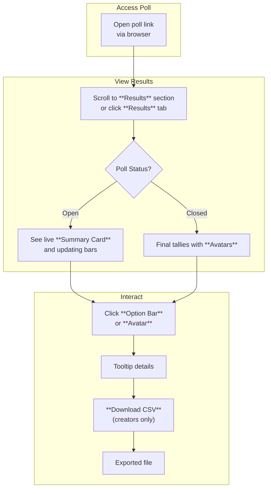

This section covers **Viewing Results**, a key feature for poll creators, participants, and shared viewers to examine poll outcomes including aggregated scores, participant avatars, and concise summaries. It's available to anyone with access to a poll link, whether on desktop or mobile devices, providing seamless responsive views that adapt to screen size. After creating a poll [Creating and Sharing Polls](creating-and-sharing-polls.md) or casting votes [Participating and Voting](participating-and-voting.md), results become visible immediately (or upon poll closure if configured). For further poll management like finalizing outcomes, see [Managing Polls](managing-polls.md).

## Overview
**Viewing Results** displays real-time or final poll tallies in an intuitive, responsive format. On larger screens, it shows detailed layouts with side-by-side comparisons; on smaller screens, it stacks elements vertically for easy scrolling. Key elements include vote counts or percentages per option, thumbnails of voter avatars, and a summary card highlighting the top result or overall winner.

## Accessing Results
To view results:
1. Open the poll via its unique shareable link (sent via email, chat, or copied from [Creating and Sharing Polls](creating-and-sharing-polls.md)).
2. Scroll to the bottom of the poll page or click the **Results** tab if voting is complete.
3. Results update live as votes are cast, unless the poll is set to **Hide Results Until Closed** in poll settings.

> [!NOTE]  
> Guest voters (non-logged-in users) see anonymized results without avatars; logged-in participants see full details including their own vote.

## What You See in Results
Results adapt automatically to your device:

| Display Mode | Screen Size | Layout Features |
|--------------|-------------|-----------------|
| **Mobile** | Under 640px wide (phones) | Vertical stack: Summary at top, option bars below, avatars in a horizontal scrollable row. Touch-friendly swipe gestures for navigation. |
| **Desktop/Tablet** | 640px and wider | Side-by-side panels: Left for option scores and bars, right for participant list with avatars. Hover tooltips show exact vote details. |

Common elements across views:
- **Summary Card**: Shows *Total Votes*, *Poll Winner* (e.g., "Option A: 65%"), and *Status* (*Open*, *Closed*, or *Scheduled*).
- **Option Bars**: Horizontal progress bars colored by leading option, labeled with **Option Name**, vote count, and percentage.
- **Participant Avatars**: Circular thumbnails (with initials if no photo), clickable to reveal voter name and timestamp.
- **Live Indicator**: A pulsing **Live** badge if votes are ongoing.

## Interacting with Results
- Click or tap an **Option Bar** to highlight its voters.
- Hover/tap **Avatars** for a tooltip with *Voted: Option X at [time]*.
- Use the **Share Results** button to copy a static image or link.
- **Download CSV** exports vote data (creator-only): Includes columns for voter ID, option selected, and timestamp.

No direct editing is available here—use [Managing Polls](managing-polls.md) for changes.

## Result Display Modes
Customize visibility indirectly via poll settings (set during creation):

| Setting | Default | Options | What It Controls |
|---------|---------|---------|------------------|
| **Show Results** | *Always* | *Live*, *After Close*, *Never* | When scores and summaries appear (live updates vs. hidden until poll ends). |
| **Reveal Voters** | *Logged-in Only* | *All*, *None*, *Logged-in Only* | Whether avatars and names display for guests. |
| **Sort By** | *Vote Count* | *Vote Count*, *Alphabetical*, *Vote Time* | Order of options and participants in the view. |

## Viewing Workflow

## Summary
- **Responsive design** ensures clear views of aggregated scores, **Summary Cards**, **Option Bars**, and **Participant Avatars** on any device.
- Interact via clicks, hovers, and exports for deeper insights.
- Controls like **Show Results** and **Reveal Voters** (set in [Creating and Sharing Polls](creating-and-sharing-polls.md)) tailor the experience.
- For poll lifecycle actions, refer to [Participating and Voting](participating-and-voting.md) and [Managing Polls](managing-polls.md). For team-shared results, see [Spaces and Team Collaboration](spaces-and-team-collaboration.md).