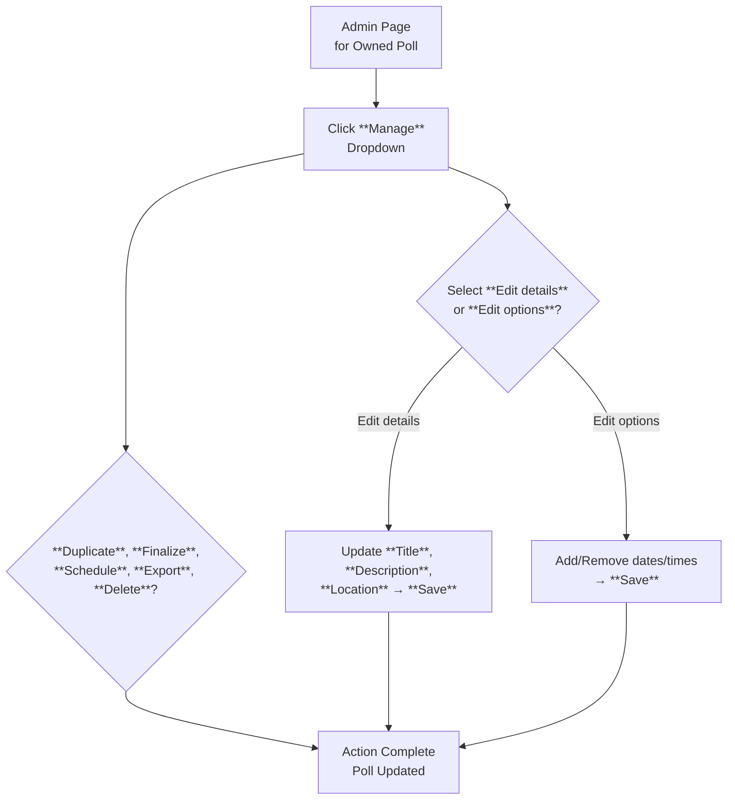

This section covers managing your polls as the poll owner, allowing you to edit details like title and description, adjust options such as dates and times, duplicate polls, finalize or schedule events, export participant data as CSV, or delete polls entirely. It's designed for poll creators who need to update, control, or archive polls after sharing them with participants. These tools are accessed from the admin page for each poll. For creating polls initially, see [Creating and Sharing Polls](creating-and-sharing-polls.md). For viewing live results during voting, see [Participating and Voting](participating-and-voting.md) > 4.1. Viewing Results. Related team features are in [Spaces and Team Collaboration](spaces-and-team-collaboration.md).

## Overview
The poll management area provides a centralized **Manage** dropdown on the admin page, giving poll owners quick access to all maintenance actions without disrupting participant voting. Key capabilities include editing core details, modifying available options, duplicating for reuse, finalizing to lock responses, scheduling event reminders, exporting data for analysis, and safe deletion. Changes like edits update the poll in real-time for participants, while actions like finalizing prevent further votes.

## Accessing Poll Management
On the admin page for any poll you own:
- Locate the **Manage** button (typically in the top-right corner).
- Click **Manage** to open the dropdown menu listing all actions: **Edit details**, **Edit options**, **Duplicate**, **Finalize**, **Schedule event**, **Export CSV**, **Delete**.

> [!NOTE]  
> Only poll owners see the admin page and **Manage** button. Participants view a read-only poll interface.

## Editing Poll Details
Use this to update the poll's title, description, or location, which appear prominently for all participants.

1. Click **Manage** > **Edit details**.
2. A form opens with editable fields.
3. Enter changes and click **Save** to apply them instantly.

| Field          | Required | Accepted Values                  | Description |
|----------------|----------|----------------------------------|-------------|
| **Title**     | Yes     | Up to 100 characters, text only | The main heading shown to voters; changes update everywhere. |
| **Description**| No      | Up to 500 characters, text with basic formatting | Additional context or instructions for participants. |
| **Location**  | No      | Up to 200 characters, free text | Meeting venue or virtual link; optional for non-meeting polls. |

## Editing Poll Options
Adjust available dates, times, or other choices participants can vote on.

1. Click **Manage** > **Edit options**.
2. Use the built-in date/time picker to add new options or remove existing ones.
3. Click **Save** to update; removed options discard any votes on them (with confirmation prompt).

> [!WARNING]  
> Removing options deletes associated votes irreversibly—confirm before saving.

Supported formats: Standard calendar picker for dates, 12/24-hour time selectors.

## Other Management Actions
From the **Manage** dropdown:

| Action       | What It Does | Confirmation Required | Reversibility |
|--------------|--------------|-----------------------|---------------|
| **Duplicate**| Creates an identical copy of the poll (new ID, no votes carried over). | No | Yes, manage the duplicate separately. |
| **Finalize** | Locks the poll—stops new votes, shows final results. | Yes | No, creates a snapshot; original remains viewable. |
| **Schedule event** | Sets a future event date/time based on top-voted option; sends reminders via email. | No | Yes, edit details afterward. |
| **Export CSV**| Downloads a file with voter selections, timestamps, and counts. | No | N/A (download only). |
| **Delete**   | Permanently removes the poll and all data. | Yes (double-prompt) | No. |

## Poll Management Workflow

## Summary
- Access all controls via **Manage** dropdown on the poll's admin page.
- Edit **details** for text changes or **options** for dates/times using simple forms and pickers.
- Use **Duplicate** for reuse, **Finalize** to end voting, **Export CSV** for data, and **Delete** cautiously.
- For initial poll creation, see [Creating and Sharing Polls](creating-and-sharing-polls.md); for results analysis, see [Participating and Voting](participating-and-voting.md) > 4.1. Viewing Results; team polls in [Spaces and Team Collaboration](spaces-and-team-collaboration.md).