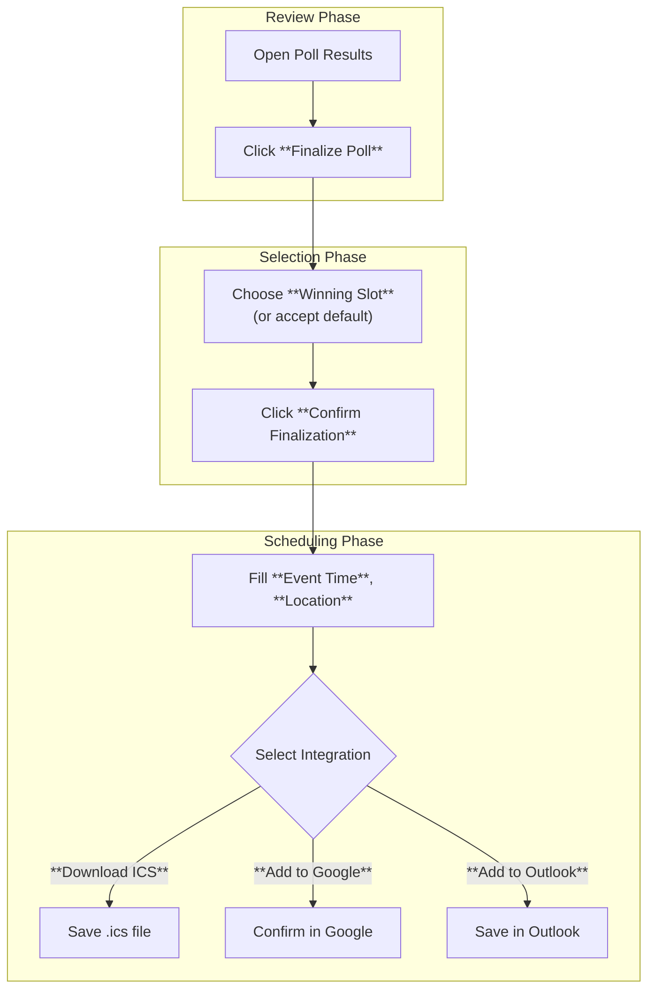

This section covers finalizing and scheduling polls, enabling poll creators to lock in results, select the optimal time based on participant votes, generate calendar events, and add them directly to Google or Outlook calendars. It's designed for poll owners who have gathered responses via [Creating and Sharing Polls](creating-and-sharing-polls.md) and [Participating and Voting](participating-and-voting.md). Once finalized, polls transition from open voting to booked events, streamlining the path from coordination to confirmation. For team-based scheduling in shared workspaces, see [Spaces and Team Collaboration](spaces-and-team-collaboration.md). Related workflows include reviewing results in 4.1. Viewing Results.

## Overview
Finalizing a poll marks it as complete, preventing further votes and highlighting the winning time slot. From there, you can create a calendar event for the selected time and export it or add it directly to your Google or Outlook calendar. This feature ensures seamless transition from polling to real-world scheduling, with automatic time zone handling based on your poll's settings.

## Accessing Finalization and Scheduling
Navigate to your poll's main page from the dashboard or invite link. Once participants have voted, look for the **Finalize Poll** button near the top-right of the results view, below the poll title and description.

> [!NOTE]  
> You must be the poll creator to finalize or schedule. Guests or participants see read-only results after finalization.

## Finalizing the Poll
1. Review the results grid showing vote tallies for each time slot.
2. Click **Finalize Poll** to lock the poll—further votes are disabled, and a "Finalized" badge appears on the poll.
3. Optionally, select a **Winning Slot** from the dropdown or by clicking a time slot (the one with the most "Yes" votes is pre-highlighted).
4. Click **Confirm Finalization** in the dialog to proceed.

Finalized polls display a prominent **Winning Time** banner with the selected date, start/end times, and participant count.

## Creating and Adding Calendar Events
After finalization, the **Schedule Event** section appears below the results.

1. Verify the **Event Time** shows the winning slot (editable if needed).
2. Fill in optional details like **Location** or **Additional Notes**.
3. Choose your integration:
   - Click **Download ICS** to get a .ics file for any calendar app.
   - Click **Add to Google Calendar** (redirects to Google with pre-filled event).
   - Click **Add to Outlook** (opens Outlook web/app with event ready to save).
4. Confirm and save—the event is created with the poll title as the event name, description including poll link, and all participants auto-added as attendees where supported.

| Calendar Option | Requirements | Supported Attendees | Notes |
|-----------------|--------------|---------------------|-------|
| **Download ICS** | None | Manual import | Universal format; works with Apple Calendar, etc. |
| **Add to Google Calendar** | Google account linked | Up to 50 via email | Auto-detects your primary calendar. |
| **Add to Outlook** | Outlook.com or Microsoft 365 account | Up to 100 via email | Supports Teams integration if enabled. |

> [!WARNING]  
> Adding to calendars sends email invites to participants only if their emails were collected during voting. Finalizing is irreversible—use **Unfinalize Poll** (available for 24 hours post-finalization) if needed.

## Configuration Options
Customize scheduling behavior via these poll-level settings, accessible before or after finalization from the **Poll Settings** gear icon.

| Setting | Default | Options | What It Controls |
|---------|---------|---------|------------------|
| **Auto Time Zone** | Enabled | On/Off | Converts times to each participant's local zone in calendar exports. |
| **Include Poll Link** | On | On/Off | Adds poll URL to event description for reference. |
| **Attendee Emails** | Collected if provided | All voters/Winning voters/None | Who receives calendar invites (respects privacy settings). |

## Troubleshooting
Common issues and resolutions:

| Message | Severity | Meaning |
|---------|----------|---------|
| "Poll must have votes to finalize" | Error | No responses yet—share the invite link and wait for [Participating and Voting](participating-and-voting.md). |
| "Calendar integration unavailable" | Warning | Browser blocks popups or no account linked—enable popups and log in to Google/Outlook. |
| "Time zone mismatch in export" | Info | Local settings override poll config—toggle **Auto Time Zone** in settings. |

## Summary
- Finalize polls to lock results and select the winning time slot after collecting votes.
- Generate ICS files or add events directly to **Google Calendar** or **Outlook** with pre-filled details.
- Configure time zones, attendees, and links via **Poll Settings** for tailored exports.
- For viewing live results before finalizing, see 4.1. Viewing Results; for team polls, explore [Spaces and Team Collaboration](spaces-and-team-collaboration.md). To create new polls, return to [Creating and Sharing Polls](creating-and-sharing-polls.md).