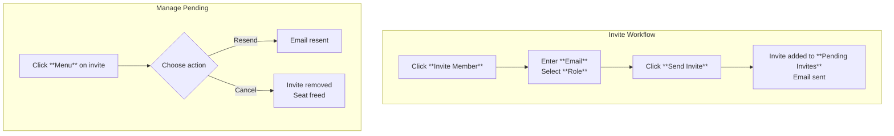

This section covers managing members within a Space, the collaborative workspace for teams creating and sharing polls. Space owners and administrators use these tools to invite participants, view member details and roles, handle pending invites, and monitor seat usage. It integrates with team collaboration features, ensuring controlled access to polls and dashboards. For broader Space management, see [Spaces and Team Collaboration](spaces-and-team-collaboration.md) and [Space Dashboard](space-dashboard.md). Seat limits tie into billing; see [Billing and Subscriptions](billing-and-subscriptions.md) for adjustments.

## Overview
The **Members** page provides a complete view of your Space's team, divided into active members and pending invites. Active members display profiles, roles, and management options. Pending invites show email addresses and invitation details with controls to manage them. Seat usage is tracked to prevent overages, with alerts for limits. All actions help maintain secure, role-based access to Space resources like polls and the dashboard.

## Viewing Active Members
Active members appear in a stacked list at the top of the page.

Each member entry includes:
- **Avatar**: Profile image or initial based on name.
- **Name**: Display name (bold, prominent).
- **Owner** badge: Shown only for the Space owner.
- **Email**: Contact address below the name.
- **Role**: Badge indicating permissions (e.g., *Owner*, *Admin*, *Member*).
- **Menu** (three dots icon): Access to management actions.

| Field | Required | Accepted Values | Description |
|-------|----------|-----------------|-------------|
| **Name** | Yes | Text string | Full or display name of the member. |
| **Email** | Yes | Valid email address | Primary contact and login identifier. |
| **Role** | Yes | *Owner*, *Admin*, *Member* | Defines permissions; *Owner* has full control including member management. |
| **Owner** badge | N/A | Icon badge | Identifies the creator/primary owner; non-editable. |

> [!NOTE]  
> Roles control what members can do, such as editing polls or inviting others. Owners cannot be removed.

## Managing Active Members
Click the **Menu** (three dots) next to any member to open options:
1. Select **Change Role** to assign a new role (*Admin* or *Member* for non-owners).
2. Select **Remove** to revoke access (confirms before proceeding; owner cannot be removed).

Changes update instantly, reflecting in the list and across the Space (e.g., dashboard access).

## Viewing Pending Invites
Below a divider, the **Pending Invites** section lists unaccepted invitations.

Each invite entry includes:
- **Avatar**: Generated from email.
- **Email**: Invitee's address.
- **Invited by**: Name of the inviter.
- **Role**: Pre-assigned role for the invitee.
- **Menu** (three dots): Management actions.

If no pending invites exist, only the invite button and seat info appear.

| Field | Required | Accepted Values | Description |
|-------|----------|-----------------|-------------|
| **Email** | Yes | Valid email address | Target recipient of the invite. |
| **Invited by** | Yes | Member name | Who sent the invite. |
| **Role** | Yes | *Admin*, *Member* | Role the new member will receive upon accepting. |

## Inviting New Members
Seats limit total members (including pending). The bottom of the **Pending Invites** section shows:

- **Invite Member** button: Primary way to add users.
- **Seat usage** indicator: e.g., *5 of 10 seats used*.

To invite:
1. Click **Invite Member**.
2. Enter the **email address** and select a **role** (*Admin* or *Member*).
3. Click **Send Invite**.

The invite appears in the pending list immediately. Recipients receive an email link to join.

| Invitation Method | Description | Requirements |
|-------------------|-------------|--------------|
| **Invite Member** button | Direct email invite with role selection. | Available seats; valid email. |
| **Resend** (from menu) | Retry delivery for pending invites. | Invite exists. |
| **Cancel** (from menu) | Delete pending invite, freeing a seat. | Invite exists. |

## Seat Management
Seats enforce member limits:
- Display: **{used} of {total} seats used**.
- When full: Info alert appears with action links.

| Alert Message | Context | Action |
|---------------|---------|--------|
| *Increase the number of seats in this space from the billing page.* | Cloud-hosted, no seats left. | Click **billing page** link to [Billing and Subscriptions](billing-and-subscriptions.md). |
| *You will need to upgrade to increase the number of seats in this space.* | Self-hosted, no seats left. | Click **upgrade** link for licensing info. |

> [!WARNING]  
> Invites and members count toward seats. Cancel pending invites or upgrade to add more.

## Summary
- View and manage active **members** with profiles, roles, and per-member **menus** for changes or removal.
- Handle **pending invites** via lists and **menus** (resend/cancel); invite new ones with the **Invite Member** button.
- Monitor **seat usage** to avoid limits; upgrade via alerts linking to billing.
- Roles (*Owner*, *Admin*, *Member*) control Space access; changes apply Space-wide.

For Space overviews, see [Spaces and Team Collaboration](spaces-and-team-collaboration.md) and [Space Dashboard](space-dashboard.md). Adjust plans in [Billing and Subscriptions](billing-and-subscriptions.md). Notifications for invites appear in [User Settings and Preferences](user-settings-and-preferences.md).