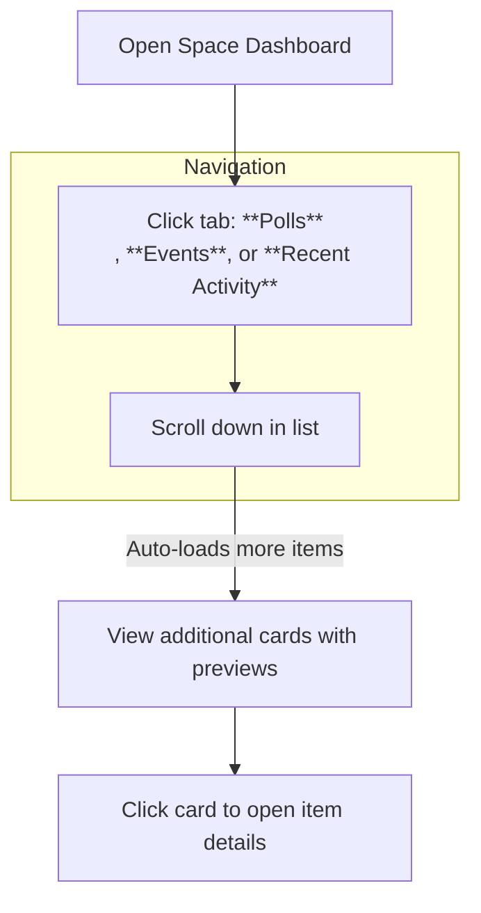

This section covers the **Space Dashboard**, the central hub for space owners and members to monitor polls, events, and recent team activity within a collaborative space. It provides a real-time overview tailored for teams using shared spaces to run polls and coordinate events, with infinite-scrolling lists for seamless browsing. The dashboard integrates with your space's polls and member actions, helping you stay updated without navigating deep menus. For adding or managing space members, see [Managing Members](managing-members.md). For creating polls to appear here, see [Creating and Sharing Polls](creating-and-sharing-polls.md). For viewing poll results, see [Viewing Results](viewing-results.md).

## Overview

The **Space Dashboard** displays key activity across your space through intuitive tabs, each featuring an infinite list that loads more items as you scroll. Access it by selecting your space from the main navigation and clicking **Dashboard** in the space menu. You'll see summaries of active polls, scheduled events, and a chronological feed of recent actions like votes, comments, or member joins. Use it to quickly spot trends, jump into polls, or track team engagement.

## Dashboard Layout and Tabs

The dashboard opens to a tabbed interface with three main tabs at the top: **Polls**, **Events**, and **Recent Activity**. Each tab shows a scrollable list with cards for individual items, including previews, timestamps, and action buttons. Scroll down to load more entries automatically—no pagination buttons needed.

### Polls Tab
This tab lists all polls created in the space, sorted by most recent or most active (toggle via the **Sort By** dropdown).

| Field | Required | Accepted Values | Description |
|-------|----------|-----------------|-------------|
| **Poll Title** | N/A | Read-only text | The poll's name with a progress indicator (e.g., *57 votes / 100 participants*) |
| **Status Badge** | N/A | *Active*, *Closed*, *Scheduled* | Color-coded label showing poll lifecycle |
| **Created By** | N/A | Member name/avatar | Who created the poll, with link to their profile |
| **Last Updated** | N/A | Date/time | When the poll was last modified or voted on |

**Actions:**
- Click a poll card to open it in full view.
- **Vote Now** button (on active polls) jumps to the voting interface.
- **Share** button generates a link for external participants.
- **Sort By** dropdown: *Recent*, *Most Votes*, *Ending Soon*.
- **Create Poll** button (top-right) starts a new poll wizard.

### Events Tab
Lists scheduled events tied to the space, such as poll deadlines or custom reminders, sorted chronologically.

| Field | Required | Accepted Values | Description |
|-------|----------|-----------------|-------------|
| **Event Name** | N/A | Read-only text | Descriptive title (e.g., *Q2 Poll Closes*) |
| **Date/Time** | N/A | Formatted date | Start/end times with timezone indicator |
| **Type Badge** | N/A | *Poll*, *Reminder*, *Meeting* | Icon and label for event category |
| **Participants** | N/A | Count/avatar list | Number attending or affected |

**Actions:**
- Click an event card to view details or RSVP.
- **Edit** button (for space owners) opens the event editor.
- **Calendar Export** downloads ICS file.
- Filter bar: Search by name or date range.

### Recent Activity Tab
A real-time feed of all space actions, like new polls, votes, comments, or member changes. Updates automatically every 30 seconds.

| Field | Required | Accepted Values | Description |
|-------|----------|-----------------|-------------|
| **Activity Icon** | N/A | Emoji/symbol | Visual cue (e.g., 🗳️ for vote, 👤 for join) |
| **Description** | N/A | Read-only text | Narrative like "*Alice voted on Marketing Poll*" |
| **Timestamp** | N/A | Relative time (e.g., *2 min ago*) | When it occurred, with absolute time on hover |
| **Actor** | N/A | Member name | Who performed the action |

**Actions:**
- Click any entry to jump to the related poll/event.
- **Mark All Read** button clears notification dots.
- **Filter** dropdown: *All*, *Polls*, *Votes*, *Members*.

## Step-by-Step Workflows

### Switching Tabs and Loading More Content
1. Click a tab name (**Polls**, **Events**, or **Recent Activity**) to switch views.
2. Scroll to the bottom of the list—the next batch of items loads automatically.
3. Use the search bar (top of each tab) to filter by keyword.

### Quick Actions from Dashboard
1. Locate the relevant tab and item.
2. Click **Create Poll**, **Vote Now**, or **Share**.
3. Follow prompts to complete the action (e.g., enter poll details).

> [!NOTE]  
> Infinite lists respect your browser's performance—loading pauses if inactive.

> [!WARNING]  
> Closing a poll from the dashboard affects all participants; confirm before proceeding.

## Configuration / Settings

Customize the dashboard via the **Settings** gear icon (top-right).

| Setting | Default | Options | What It Controls |
|---------|---------|---------|------------------|
| **Auto-Refresh** | *On (30s)* | *Off*, *15s*, *30s*, *1min* | Frequency of **Recent Activity** updates |
| **Default Tab** | *Polls* | *Polls*, *Events*, *Recent Activity* | Tab shown on initial load |
| **Sort Order** | *Recent* | *Recent*, *Alphabetical*, *Most Active* | Default sorting for lists |
| **Show Avatars** | *On* | *On*, *Off* | Display member photos in cards/feeds |

Changes apply immediately and persist per user.

## Troubleshooting

Common issues and resolutions:

| Message | Severity | Meaning |
|---------|----------|---------|
| "No activity yet—create your first poll!" | Info | Empty space; start by clicking **Create Poll**. |
| "Loading more items... (slow connection)" | Warning | Network delay; check internet and refresh page. |
| "Failed to load recent activity" | Error | Temporary service issue; retry or check space permissions. See [User Settings and Preferences](user-settings-and-preferences.md). |

## Summary
- **Space Dashboard** offers tabbed, infinite-scroll views of **Polls**, **Events**, and **Recent Activity** for team oversight.
- Interact via card clicks, **Sort By**/**Filter** controls, and quick-action buttons like **Create Poll** or **Vote Now**.
- Configure refresh rates and defaults in **Settings** for personalized use.
- For member management, see [Managing Members](managing-members.md); for poll creation, [Creating and Sharing Polls](creating-and-sharing-polls.md); for notifications, [Notifications and Emails](notifications-and-emails.md).