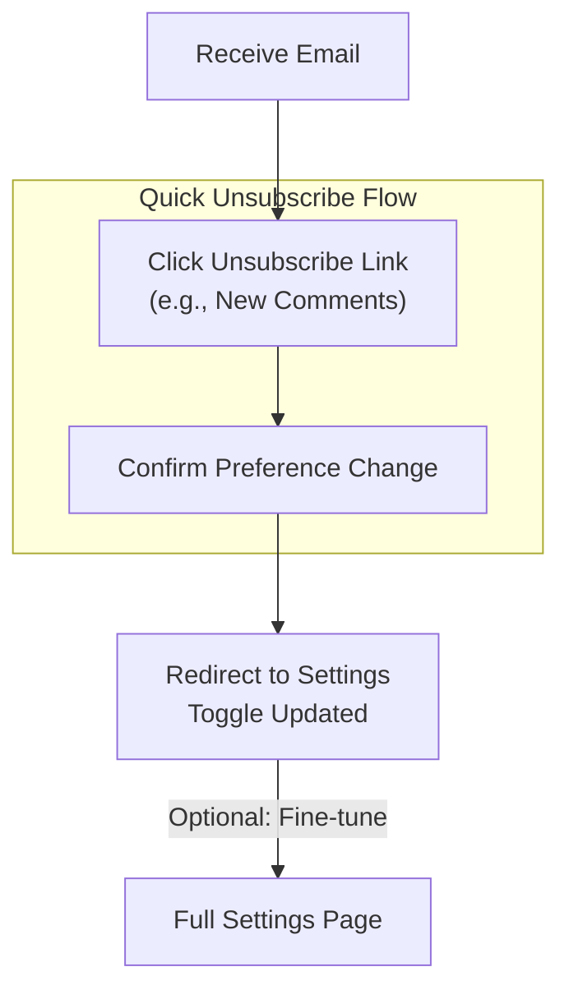

This section covers notifications and email preferences, enabling logged-in users to customize when they receive updates about polls, comments, and other activities. It's designed for anyone with an account who participates in polls or collaborates in spaces, helping you stay informed without inbox overload. Access these settings via your profile menu after [Account Creation and Login](account-creation-and-login.md). Related features include poll invitations in Creating and Sharing Polls|3.2. Inviting Participants and space member emails in Spaces and Team Collaboration|6.1. Managing Members.

## Overview
Notification preferences let you toggle email alerts for key events like new polls you're invited to, new comments on polls you follow, and poll finalizations. All emails include an **unsubscribe link** at the bottom for quick one-click management of specific notification types. Changes take effect immediately, and defaults favor keeping you updated while allowing full customization.

## Accessing Notification Settings
1. Click your **profile icon** in the top-right corner.
2. Select **Settings** from the dropdown menu.
3. Navigate to the **Notifications** tab (or section).

You'll see a list of toggle switches for each notification type, along with a summary of your current preferences and recent email activity.

## Notification Types
Use the toggles to enable or disable emails for specific events. Here's a breakdown:

| Setting              | Default | Options     | What It Controls |
|----------------------|---------|-------------|------------------|
| **New Polls**        | On     | On/Off     | Emails when you're invited to or added as a participant in a new poll. Includes poll link and details. |
| **New Comments**     | On     | On/Off     | Emails for new comments on polls you're participating in or following. |
| **Poll Finalizations**| On    | On/Off     | Emails when a poll owner finalizes results or schedules an event based on votes. Includes summary and next steps. |
| **Space Invitations**| On     | On/Off     | Emails for invitations to join a team space (only visible if you're in spaces). |

> [!NOTE]  
> These apply account-wide but respect poll-specific privacy settings. Guest participants (no account) won't receive emails.

## Using Unsubscribe Links
Every email includes a footer with personalized **unsubscribe links**:
1. Open any notification email.
2. Scroll to the bottom and click the relevant **unsubscribe** link (e.g., "Stop emails about new comments").
3. Confirm on the landing page—your preference updates instantly without needing to log in.

This directs you to a simplified view of your **Notifications** settings for further tweaks.

## Troubleshooting
Common issues and fixes:

| Message/Issue                          | Severity | Meaning and Next Steps |
|----------------------------------------|----------|------------------------|
| No emails received                     | Warning | Check spam/junk folder first. Add your instance's domain (e.g., rallly.co) to safe senders. Verify toggles are **On** in settings. Resend a test invite via a poll. |
| "Unsubscribe failed" on link click     | Error   | Link may have expired—log in and update settings directly. Clear browser cache and retry. |
| Emails still arriving after toggling off | Warning | Propagation delay (up to 5 minutes). Check for poll-specific overrides. Use unsubscribe link in the email for immediate stop. |

> [!WARNING]  
> Disabling all notifications means missing important updates like space invites or finalizations—consider keeping at least **Space Invitations** on for teams.

## Summary
- Toggle emails for **new polls**, **new comments**, **poll finalizations**, and **space invitations** via **Settings > Notifications**.
- Use one-click **unsubscribe links** in emails for instant changes.
- Defaults are **On** for all types to keep you informed by default.
- For account basics, see [Getting Started](getting-started.md). For team invites, check Spaces and Team Collaboration|6.1. Managing Members. If emails fail entirely, review self-hosting SMTP in Self-Hosting and Administration|9.1. Configuration Options (admins only).