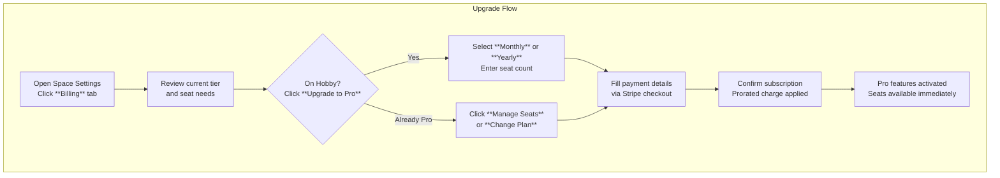

This section covers Billing and Subscriptions, the dedicated area for space owners to manage team seats, upgrade to Pro plans, view invoices, update payment methods, and track usage limits. It's essential for scaling team collaboration without interruptions, ensuring your space stays within limits as you add members. Access it via space settings. For adding members that consume seats, see [Spaces and Team Collaboration](spaces-and-team-collaboration.md) and [Managing Members](managing-members.md). For space-wide monitoring, see [Space Dashboard](space-dashboard.md). Related preferences are in [User Settings and Preferences](user-settings-and-preferences.md).

## Overview
The Billing page provides a centralized view of your space's subscription status, including the current *tier* (such as Hobby or Pro), *used seats* (active members), *total seats* (purchased capacity), and *available seats* (remaining capacity). It supports seat-based pricing where each team member requires a seat, with Pro unlocking advanced features for everyone. Key capabilities include upgrading plans, adjusting seat counts with automatic proration, accessing the billing portal for invoices and payments (powered by Stripe), and monitoring limits to avoid overages.

> [!NOTE]  
> Only space owners can access this page. Others see an *Access Denied* message with a note that owner permissions are required.

## Current Subscription Status
Upon loading the Billing page, you'll see:
- **Billing** header with a description: "Manage your billing information and subscription."
- Summary cards or metrics displaying:
  - Current *tier* (e.g., *Hobby* or *Pro*).
  - **Used Seats**: Number of active members.
  - **Total Seats**: Maximum seats paid for.
  - **Available Seats**: *Total Seats* minus *Used Seats*.
- Action buttons like **Upgrade to Pro**, **Manage Seats**, and **Open Billing Portal**.

If on Hobby, an prominent **Upgrade** section highlights Pro benefits like unlimited polls and team features.

## Plan Tiers and Limits

| Plan   | Default Seats | Maximum Seats | Key Limits and Features |
|--------|---------------|---------------|-------------------------|
| **Hobby** | *1*          | *1*          | Free; single user; basic polls; limited storage and features. No team collaboration. |
| **Pro (Monthly)** | *Set by owner* | Unlimited (seat-based) | All Pro features for every seat: unlimited polls, advanced sharing, team dashboards, priority support. |
| **Pro (Yearly)** | *Set by owner* | Unlimited (seat-based) | Same as Monthly with discount; billed annually. |

> [!NOTE]  
> Pro plans scale with seats—purchase more as your team grows. Hobby reverts automatically if Pro is canceled.

## Upgrading Your Subscription
Upgrade from Hobby to Pro or switch billing cycles (monthly to yearly for discounts).

1. Navigate to space settings and select the **Billing** tab.
2. Choose **Monthly** or **Yearly** Pro.
3. Set initial *total seats* (must be at least current *used seats*).
4. Enter payment details in the Stripe form (card number, expiry, CVC, billing address).
5. Click **Subscribe**—success redirects to the updated Billing page.

## Managing Seats
Adjust *total seats* anytime to match team size. Changes prorate immediately.

### Adding Seats
1. Click **Manage Seats**.
2. Increase the **Total Seats** field to a number greater than current *used seats*.
3. Click **Update**—prorated charge applies instantly; new seats available for invitations.

### Removing Seats
> [!WARNING]  
> Cannot reduce below *used seats*. Remove members first via [Managing Members](managing-members.md) to free seats.

1. Ensure *used seats* ≤ desired *total seats*.
2. Click **Manage Seats**.
3. Decrease the **Total Seats** field.
4. Click **Update**—credit applies to next bill.

| Field         | Required | Accepted Values          | Description |
|---------------|----------|--------------------------|-------------|
| **Total Seats** | Yes     | Integer ≥ *used seats*  | Maximum members allowed; changes trigger proration. |

## Billing Portal
Click **Open Billing Portal** to access Stripe's customer dashboard (full page redirect):
- View **billing history** and download **invoices** as PDFs.
- Update **payment method**: Add cards, set defaults, edit billing address.
- Switch **billing cycle**: Monthly ↔ Yearly.
- Cancel subscription (access continues until period end; auto-downgrades to Hobby).

Changes here sync back to your space instantly.

## Common Issues and Troubleshooting
Only space owners see full controls; others encounter:

| Message                  | Severity | Meaning |
|--------------------------|----------|---------|
| *Access Denied*         | Error   | You lack owner permissions. Contact the space owner or check your role in [Managing Members](managing-members.md). |
| *You cannot invite more members than seats available.* | Warning | *Used seats* = *total seats*. Add seats first via **Manage Seats**, then invite via [Spaces and Team Collaboration](spaces-and-team-collaboration.md). |
| *Cannot reduce seats below current members.* | Error   | Remove inactive members before lowering *total seats*. See [Managing Members](managing-members.md). |
| *Subscription pending...* | Info    | Payment processing; refresh in a few minutes or check email for Stripe receipt. |

> [!WARNING]  
> Canceling Pro downgrades to Hobby at period end—team features lost, polls may face inactivity deletion.

## Summary
- Manage seat-based Pro subscriptions with real-time *used*/*total*/*available seats* tracking.
- Upgrade via Stripe for immediate Pro access; adjust seats with proration.
- Use **Billing Portal** for invoices, payments, and history.
- Maintain *total seats* ≥ *used seats* to avoid limits.
- For team growth, cross-reference [Spaces and Team Collaboration](spaces-and-team-collaboration.md) and [Managing Members](managing-members.md); for self-hosted billing alternatives, see [Self-Hosting and Administration](self-hosting-and-administration.md).