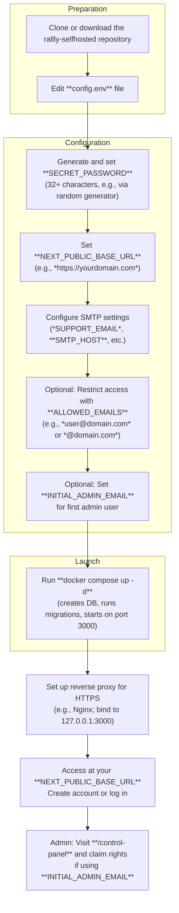

This section covers self-hosting and administering your own Rallly instance, designed for advanced users, organizations, or individuals who want full control over their data, customization, and infrastructure. Unlike the hosted service at [Getting Started](getting-started.md), self-hosting lets you deploy Rallly on your servers using Docker, configure it via simple settings files, and manage users, licensing, and branding through a dedicated admin interface. For details on subscriptions in the hosted version, see [Billing and Subscriptions](billing-and-subscriptions.md); for team features that benefit from self-hosting, see [Spaces and Team Collaboration](spaces-and-team-collaboration.md).

## Overview

Self-hosting provides complete ownership of your Rallly polls, users, and data. The official Docker setup creates a production-ready instance with a built-in database, automatic schema updates, and support for custom authentication, email notifications, and access restrictions. Key capabilities include:

- Quick deployment on any server with Docker.
- Customization of emails, login methods (email, Google, Microsoft, OIDC), and user restrictions.
- An admin **Control Panel** for managing users, licenses, and instance settings.
- Secure operation behind a reverse proxy for HTTPS.

Once deployed, your instance behaves like the hosted version but with your branding and no external dependencies. Access polls via your custom domain, and admins use the **Control Panel** at `/control-panel`.

## Requirements

Before deploying:

- A server with Docker installed.
- Access to an SMTP server for sending invitation and notification emails (required for full functionality like [Creating and Sharing Polls](creating-and-sharing-polls.md)).
- Basic server management knowledge for updates and reverse proxies.

> [!NOTE]  
> Self-hosting is free for personal, single-user use. Multi-user instances require a license, activated via the **Control Panel**. See the licensing section in the **Control Panel** for purchase details.

## Deployment Workflow

Follow these steps to set up your instance using the official Docker configuration.

1. Clone or download the repository from the official source.
2. Open the **config.env** file in the root directory.
3. Generate a secure **SECRET_PASSWORD** (at least 32 characters) and add it.
4. Set **NEXT_PUBLIC_BASE_URL** to your instance's full URL (include *http://* or *https://*, no trailing slash).
5. Fill in SMTP details: **SUPPORT_EMAIL** (required, shown to users), **SMTP_HOST**, **SMTP_PORT**, **SMTP_SECURE**, **SMTP_USER**, **SMTP_PWD**.
6. Optionally, set **ALLOWED_EMAILS** to limit sign-ups (comma-separated, supports *wildcards* like * *@example.com*).
7. Optionally, set **INITIAL_ADMIN_EMAIL** for the first admin.
8. Run **docker compose up -d** from the repository directory. This provisions the database, applies updates, and launches the app.
9. Configure a reverse proxy (e.g., Nginx, Caddy) for HTTPS, then update **docker-compose.yml** to bind port 3000 to localhost only and restart.
10. Visit your URL, create an account (if allowed), and navigate to **/control-panel** to claim admin rights if designated.

## Configuration Options

All settings are applied via the **config.env** file before starting Docker. Changes require restarting the containers (**docker compose down** then **docker compose up -d**).

| Setting                  | Default          | Options / Format                          | What It Controls |
|--------------------------|------------------|-------------------------------------------|------------------|
| **NEXT_PUBLIC_BASE_URL** | (required)      | Full URL (e.g., *https://example.com*)   | Base address for links, emails, and redirects. No trailing slash. |
| **SECRET_PASSWORD**      | (required)      | 32+ random characters                    | Encrypts user sessions and security tokens. |
| **SUPPORT_EMAIL**        | (required)      | Valid email address                      | Contact email shown to users; fallback sender for notifications. |
| **NOREPLY_EMAIL**        | Uses **SUPPORT_EMAIL** | Valid email address                 | Sender for transactional emails (e.g., invites). |
| **NOREPLY_EMAIL_NAME**   | *Rallly*        | Text string                              | Display name for email senders. |
| **INITIAL_ADMIN_EMAIL**  | None            | Valid email address                      | Email of first user eligible for admin role (claim via **Control Panel**). |
| **DATABASE_URL**         | Auto-generated by Docker | Postgres connection string            | Database connection (Docker handles by default). |
| **SMTP_HOST**            | None            | Hostname/IP                              | SMTP server address. |
| **SMTP_PORT**            | None            | Number (e.g., *587*, *465*, *25*)        | SMTP port. |
| **SMTP_SECURE**          | *false*         | *true*/*false*                           | Enables SSL (use with port 465). |
| **SMTP_USER**            | Empty           | Username string                          | SMTP authentication username. |
| **SMTP_PWD**             | Empty           | Password string                          | SMTP authentication password. |
| **SMTP_REJECT_UNAUTHORIZED** | *true*      | *true*/*false*                           | Validates TLS certificates (set *false* for self-signed, not for production). |
| **EMAIL_LOGIN_ENABLED**  | *true*          | *true*/*false*                           | Enables magic-link email login (disables registration if off). |
| **REGISTRATION_ENABLED** | *true*          | *true*/*false*                           | Allows new user sign-ups (requires email login). |
| **ALLOWED_EMAILS**       | None (all allowed) | Comma-separated emails/wildcards       | Restricts registration/login to listed addresses/domains. |

### Authentication Providers

Additional settings for OAuth/SSO (configure via provider consoles first, using your **NEXT_PUBLIC_BASE_URL** + callback path):

| Provider     | Key Settings                          | What It Controls |
|--------------|---------------------------------------|------------------|
| **Google**  | **GOOGLE_CLIENT_ID**, **GOOGLE_CLIENT_SECRET** | Google login button on sign-in page. |
| **Microsoft** | **MICROSOFT_TENANT_ID**, **MICROSOFT_CLIENT_ID**, **MICROSOFT_CLIENT_SECRET** | Microsoft Entra ID login. |
| **OIDC**    | **OIDC_DISCOVERY_URL**, **OIDC_CLIENT_ID**, **OIDC_CLIENT_SECRET**, **OIDC_NAME** (*OpenID Connect*) | Custom SSO provider name and endpoints. |

## Admin Control Panel

After deployment, access at `/control-panel` (login required).

- **Claim Admin Rights** (one-time for **INITIAL_ADMIN_EMAIL** user): See and click **Make me an admin** button.
- Manage users: View, edit, or remove accounts.
- Licensing: Activate/purchase multi-user license; view status.
- Instance settings: Branding, additional user controls, registration toggles (overridden by env vars).

Only admins see full features; regular users get a permission error.

> [!WARNING]  
> Changes in the **Control Panel** (e.g., user deletion) are permanent. Export data first if needed.

## Updating Your Instance

To apply updates:

1. In the repository directory: **docker compose down**.
2. **docker compose pull** (fetches new image; pin to major version like *lukevella/rallly:4* in **docker-compose.yml** for stability).
3. **docker compose up -d** (applies migrations automatically).

Check release notes for changes.

## Troubleshooting

Common issues and observable messages:

| Message | Severity | Meaning |
|---------|----------|---------|
| SMTP connection failed or "Email not sent" in app feedback | Error | Invalid **SMTP_HOST**, **SMTP_PORT**, or credentials. Verify settings and test SMTP server. |
| "Database migration failed" in Docker logs | Error | Postgres issue during startup/update. Check **DATABASE_URL**, disk space, or restart. Provide container logs for support. |
| "Invalid redirect URI" during OAuth login | Error | Mismatch in provider console (must match **NEXT_PUBLIC_BASE_URL** + callback). Update URIs and restart. |
| "Access denied" at `/control-panel` | Warning | Not admin or **INITIAL_ADMIN_EMAIL** not claimed. Log in as designated user and claim rights. |
| "Certificate error" in SMTP logs | Warning | Set **SMTP_REJECT_UNAUTHORIZED**=*false* for self-signed certs (test only). |

View logs: **docker compose logs -f**. For UI errors, check browser console. Report issues with version, deployment method, OS, and logs.

## Summary

- Deploy via Docker for a fully customizable instance with auto-DB setup.
- Configure everything in **config.env**: security, emails, auth, access controls.
- Use **/control-panel** to manage users, licenses, and settings post-setup.
- Update manually with **docker compose pull** and restart for latest features.

For poll creation after setup, see [Creating and Sharing Polls](creating-and-sharing-polls.md). Explore integrations in [Advanced Features and Integrations](advanced-features-and-integrations.md). For hosted alternatives, return to [Overview](overview.md).