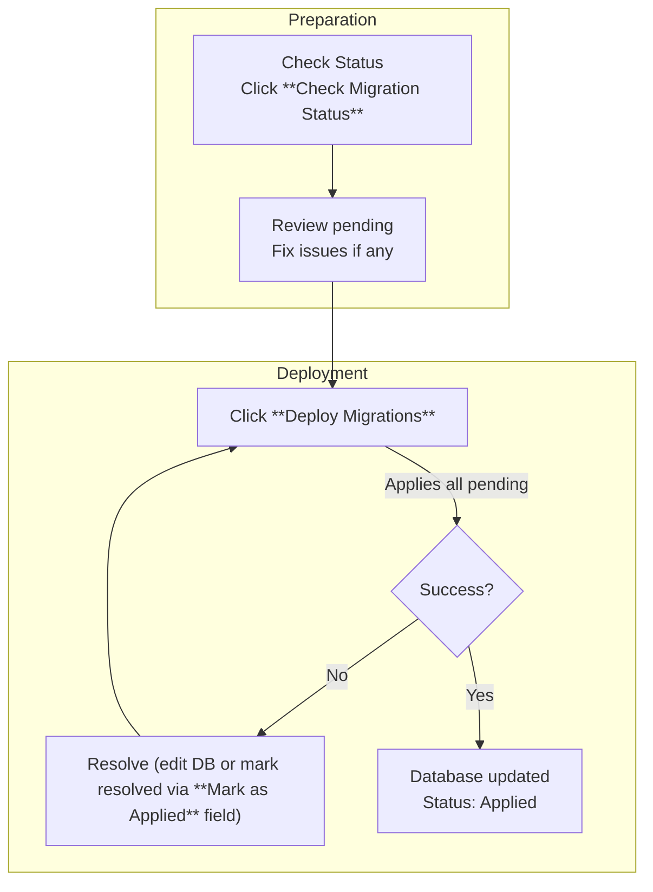

This section covers the **Control Panel**, the central admin interface for self-hosted instances where administrators handle user management, instance-wide settings, licensing, and SSO configuration. Designed for self-hosting administrators (not end users creating polls), it provides secure, web-based controls to maintain and customize your deployment. Access it after initial setup via 9.1 Configuration Options. For user-facing preferences, see 7. User Settings and Preferences and 6.1. Managing Members. Related billing for hosted plans is in 8. Billing and Subscriptions.

## Overview

The **Control Panel** offers a dashboard-style interface with tabs or sections for key admin tasks: viewing and editing users, adjusting instance behavior like logging and database connections, entering license keys for premium features, and configuring single sign-on providers. Changes apply instance-wide and require admin privileges. Use the search bar at the top to quickly find users or settings, and the **Save Changes** button (per section) to apply updates.

## Accessing the Control Panel

1. Log in to your self-hosted instance as an administrator.
2. Navigate to the main menu and select **Admin** > **Control Panel** (often locked behind role-based access).
3. Authenticate if prompted with your admin credentials.

> [!NOTE] Only users with *admin* role can access this area. Revoke access via user management if needed.

## User Management

This section lists all registered users in a searchable table with columns for **Email**, **Name**, **Role**, **Created Date**, and **Last Active**. Use the **Search Users** field to filter by email or name. Actions include creating new users, editing details, or removing them.

### Adding or Editing a User
1. Click **Add User** or select a user row and click **Edit**.
2. Fill in the form fields (see table below).
3. Click **Create User** or **Update User**.

| Field       | Required | Accepted Values                  | Description |
|-------------|----------|----------------------------------|-------------|
| **Email**  | Yes     | Valid email address (e.g., *user@example.com*) | Unique identifier for login and notifications. Must not duplicate existing users. |
| **Name**   | No      | Text up to 100 characters       | Display name shown in polls and spaces. Defaults to *Email* prefix if blank. |
| **Role**   | Yes     | *admin*, *user*, *viewer*       | Controls access: *admin* for Control Panel; *user* for creating polls; *viewer* for read-only. |
| **Password** (new users only) | Yes | Password strength rules (min 8 chars, mix case/numbers) | Initial login password; users can change later via 7. User Settings and Preferences. |

> [!WARNING] Deleting a user (**Delete User** button after confirmation) removes their polls and space access permanently. Back up data first.

Populate initial users via the **Seed Database** tool below for testing.

## Instance Settings

Adjust global behaviors like logging, error display, and database connections. Changes require a restart notification (auto-applied where possible).

| Setting          | Default     | Options                                      | What It Controls |
|------------------|-------------|----------------------------------------------|------------------|
| **Log Level**   | *info*     | *query*, *info*, *warn*, *error*; multi-select | Verbosity of logs: *query* shows all database operations; *error* only failures. View logs in your server console. |
| **Error Format**| *pretty*   | *pretty*, *colorless*, *minimal*             | How errors appear in logs or UI: *pretty* with colors/icons; *minimal* plain text. |
| **Database URL**| (empty)    | Full connection string (e.g., *postgresql://...*) | Connection to your database instance. Update after migration. Test with **Validate Connection**. |
| **Transaction Timeout** | *10000* ms | Number (1-60000)                           | Max duration for database operations before failure. |

Click **Test Settings** to verify without saving.

## Licensing

Enter or renew keys for premium features like unlimited spaces or advanced integrations.

1. Paste your **License Key** (from provider email).
2. Click **Validate License**.
3. If valid, click **Apply License**—status updates to *Active* with expiry date.

| Field         | Required | Accepted Values       | Description |
|---------------|----------|-----------------------|-------------|
| **License Key** | Yes    | Alphanumeric string  | Uniquely validates your subscription tier. Invalid keys show *Expired* or *Invalid*. |

> [!NOTE] Free tier has no key needed; see 8. Billing and Subscriptions for upgrades.

## SSO Setup

Enable single sign-on for team logins (e.g., Google, Okta). Toggle **Enable SSO** first.

| Setting             | Default | Options                          | What It Controls |
|---------------------|---------|----------------------------------|------------------|
| **SSO Provider**   | None   | *Google*, *Okta*, *Custom OIDC* | Selects integration; *Custom OIDC* for others. |
| **Client ID**      | (empty)| Alphanumeric string             | From your SSO provider dashboard. |
| **Client Secret**  | (empty)| Secure string                   | Keep confidential; enables auth flow. |
| **Redirect URI**   | Auto   | Custom URL (optional)           | Where SSO redirects after login (pre-fills with your instance URL). |

1. Configure in your SSO provider.
2. Enter details and click **Test SSO Login**.
3. Save—users see **Login with SSO** button on login page.

## Database Management

Tools for maintaining your database: seeding initial data and applying updates safely.

### Seeding the Database
Populates test users/polls. Safe to re-run (idempotent).

1. Select **Seed Database** tab.
2. Optional: Enter **Custom Config Path** or **Arguments** (e.g., *--environment test*).
3. Click **Run Seed**.

| Field              | Required | Accepted Values | Description |
|--------------------|----------|-----------------|-------------|
| **Custom Config Path** | No     | File path      | Overrides default config for seeding. |
| **Arguments**      | No      | Text string    | Passed to seed process (e.g., for env-specific data). |

### Deploying Migrations
Applies pending database changes (no new creation here—do locally first).

| Action/Button          | Description |
|------------------------|-------------|
| **Check Migration Status** | Lists *applied*, *pending*, or *failed*. |
| **Deploy Migrations** | Applies all pending; fails on errors. |
| **Mark as Applied**  | For failed ones: enter migration name, resolve manually first. |

> [!WARNING] Run in staging first; back up database before deploying.

## Troubleshooting

Common messages in server logs, browser console, or **View Logs** button.

| Message | Severity | Meaning |
|---------|----------|---------|
| "Seed script completed successfully" | Info | Initial data populated; safe to re-run. Check users list. |
| "Migration applied successfully" | Info | Database schema updated; verify polls/spaces work. |
| "Failed to connect to database" | Error | Invalid **Database URL**; check credentials and restart. |
| "Migration failed: 
" | Error | Pending change incompatible; use **Mark as Applied** after manual fix or rollback. |
| "License validation failed" | Warning | Key expired/invalid; renew via provider or contact support. |
| "SSO auth error: invalid client" | Error | Mismatch in **Client ID/Secret**; re-copy from provider. |

## Summary

- **Control Panel** centralizes admin tasks: manage users, tweak settings, license features, set up SSO, and handle database ops.
- Key workflows: Add users via form, deploy migrations step-by-step, seed for testing.
- Secure and instance-wide: Always validate/test before saving.
- For setup basics, see 9.1 Configuration Options; team management in 6.1. Managing Members; advanced self-hosting in 10. Advanced Features and Integrations.